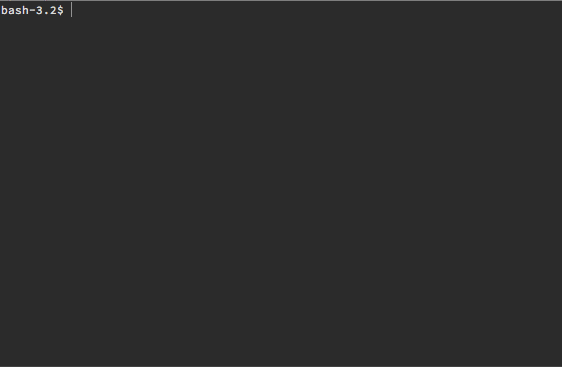

# node-color-readline
Node.js 'readline' alternative with support for coloured syntax highlighting and suggestions.

```sh
npm install --save node-color-readline
```

Usage:

```js

var colorReadline = require('node-color-readline');
var chalk = require('chalk');
var repl = colorReadline.createInterface({
  input: process.stdin,
  output: process.stdout,
  colorize: function (str) {
    // Make all occurences of 'e' red.
    return str.replace(/e/g, function (match) {
      return chalk.red(match);
    });
  }
});

repl.on('line', function (cmd) {
  console.log('LINE:', cmd);
});

repl.prompt();
```


